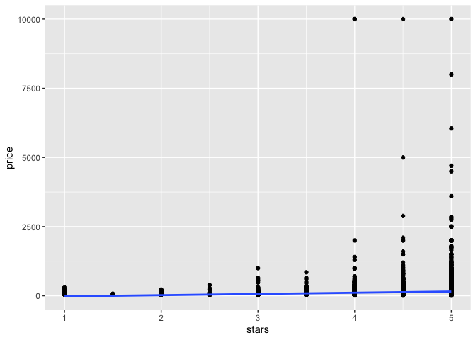

bootstrap
================
2024-11-23

``` r
library(tidyverse)
library(p8105.datasets)
library(modelr)

set.seed(1)
```

``` r
n_samp = 250

sim_df_const = 
  tibble(
    x = rnorm(n_samp, 1, 1),
    error = rnorm(n_samp, 0, 1),
    y = 2 + 3 * x + error
  )

sim_df_nonconst = sim_df_const |> 
  mutate(
  error = error * .75 * x,
  y = 2 + 3 * x + error
)
```

look at the datasets

``` r
sim_df = 
  bind_rows(const = sim_df_const, nonconst = sim_df_nonconst, .id = "data_source") 

sim_df |> 
  ggplot(aes(x = x, y = y)) + 
  geom_point(alpha = .5) +
  stat_smooth(method = "lm") +
  facet_grid(~data_source)
```

    ## `geom_smooth()` using formula = 'y ~ x'

<!-- --> These
datasets have roughly the same overall variance, but the left panel
shows data with constant variance and the right panel shows data with
non-constant variance. For this reason, ordinary least squares should
provide reasonable estimates in both cases, but inference is standard
inference approaches may only be justified for the data on the left.

The output below shows results from fitting simple linear regressions to
both datasets.

``` r
lm(y ~ x, data = sim_df_const) |> 
  broom::tidy() |> 
  knitr::kable(digits = 3)
```

| term        | estimate | std.error | statistic | p.value |
|:------------|---------:|----------:|----------:|--------:|
| (Intercept) |    1.977 |     0.098 |    20.157 |       0 |
| x           |    3.045 |     0.070 |    43.537 |       0 |

``` r
lm(y ~ x, data = sim_df_nonconst) |> 
  broom::tidy() |> 
  knitr::kable(digits = 3)
```

| term        | estimate | std.error | statistic | p.value |
|:------------|---------:|----------:|----------:|--------:|
| (Intercept) |    1.934 |     0.105 |    18.456 |       0 |
| x           |    3.112 |     0.075 |    41.661 |       0 |

# Drawing one bootstrap sample

``` r
boot_sample = function(df) {
  boot_df =
  sample_frac(df, replace = TRUE) |> 
    arrange(x)
  
return(boot_df)
}
```

let’s try running the function

``` r
#each sample gives a slightly different regression fit
sim_df_nonconst |> 
  boot_sample() |>  #a dataframe arranged by x
  ggplot(aes(x = x, y = y))+
  geom_point(alpha = 0.5)+
  stat_smooth(method = "lm")
```

    ## `geom_smooth()` using formula = 'y ~ x'

<!-- --> As an
analysis

``` r
sim_df_nonconst |> 
  boot_sample() |> 
  lm(y ~ x, data =_) |> 
  broom::tidy() |> 
  knitr::kable(digits = 2)
```

| term        | estimate | std.error | statistic | p.value |
|:------------|---------:|----------:|----------:|--------:|
| (Intercept) |     1.90 |      0.10 |     19.31 |       0 |
| x           |     3.14 |      0.07 |     45.64 |       0 |

## Bootstrap a lot!

``` r
boot_straps = 
  tibble(
    strap_number = 1:1000
  ) |> 
  mutate(
    strap_sample = map(strap_number, \(i) boot_sample(df = sim_df_nonconst)),
    models = map(strap_sample, \(df) lm(y ~ x, data = df)),
    results = map(models, broom::tidy)
  )

# check data structure
boot_straps |> 
  pull(strap_sample) |> 
  nth(1)
```

    ## # A tibble: 250 × 3
    ##         x  error       y
    ##     <dbl>  <dbl>   <dbl>
    ##  1 -1.29   1.40  -0.454 
    ##  2 -0.989 -1.97  -2.93  
    ##  3 -0.914 -0.908 -1.65  
    ##  4 -0.914 -0.908 -1.65  
    ##  5 -0.805  0.292 -0.123 
    ##  6 -0.805  0.292 -0.123 
    ##  7 -0.665 -0.544 -0.539 
    ##  8 -0.641 -0.416 -0.338 
    ##  9 -0.606 -0.106  0.0774
    ## 10 -0.606 -0.106  0.0774
    ## # ℹ 240 more rows

``` r
boot_straps |> 
  pull(models) |> 
  nth(1)
```

    ## 
    ## Call:
    ## lm(formula = y ~ x, data = df)
    ## 
    ## Coefficients:
    ## (Intercept)            x  
    ##       1.894        3.121

``` r
#bootstrap results
bootstrap_results = 
  boot_straps |> 
  select(strap_number, results) |> 
  unnest(results) |> 
  group_by(term) |> 
  summarize(
    boot_se = sd(estimate)
  )
```

## do this using modelr

``` r
boot_straps = 
  sim_df_nonconst |> 
  modelr::bootstrap(1000) |> 
  mutate(
    strap = map(strap, as_tibble),
    models = map(strap, \(df) lm(y ~ x, data = df)),
    results = map(models, broom::tidy)
  ) |> 
  select(.id, results) |> 
  unnest(results)
```

# Airbnb data

``` r
data("nyc_airbnb")

nyc_airbnb = 
  nyc_airbnb |> 
  mutate(stars = review_scores_location / 2) |> 
  rename(
    borough = neighbourhood_group,
    neighborhood = neighbourhood) |> 
  filter(borough != "Staten Island") |> 
  drop_na(price, stars) |> 
  select(price, stars, borough, neighborhood, room_type)
```

``` r
nyc_airbnb |> 
  ggplot(aes(x = stars, y = price)) + 
  geom_point() +
  stat_smooth(method = "lm", se = FALSE)
```

    ## `geom_smooth()` using formula = 'y ~ x'

<!-- --> fit a
regression

``` r
lm(price ~ stars + room_type, data = nyc_airbnb) |> 
  broom::tidy()
```

    ## # A tibble: 4 × 5
    ##   term                  estimate std.error statistic   p.value
    ##   <chr>                    <dbl>     <dbl>     <dbl>     <dbl>
    ## 1 (Intercept)               51.4     11.5       4.46 8.25e-  6
    ## 2 stars                     30.6      2.41     12.7  8.00e- 37
    ## 3 room_typePrivate room   -111.       2.05    -54.1  0        
    ## 4 room_typeShared room    -132.       6.18    -21.3  3.11e-100

``` r
# we cannot trust the se in this case
```

bootstrap for (maybe) better inference

``` r
nyc_airbnb |> 
  modelr::bootstrap(1000) |> 
  mutate(
    strap = map(strap, as_tibble), 
    models = map(strap, \(df) lm(price ~ stars + room_type, data = df)),
    results = map(models, broom::tidy)
  ) |> 
  select(.id, results) |> 
  unnest(results) |> 
  filter(term =="stars") |> 
  ggplot(aes(estimate))+
  geom_density()
```

<!-- --> This
distribution has a heavy tail extending to low values and a bit of a
“shoulder”, features that may be related to the frequency with which
large outliers are included in the bootstrap sample.
