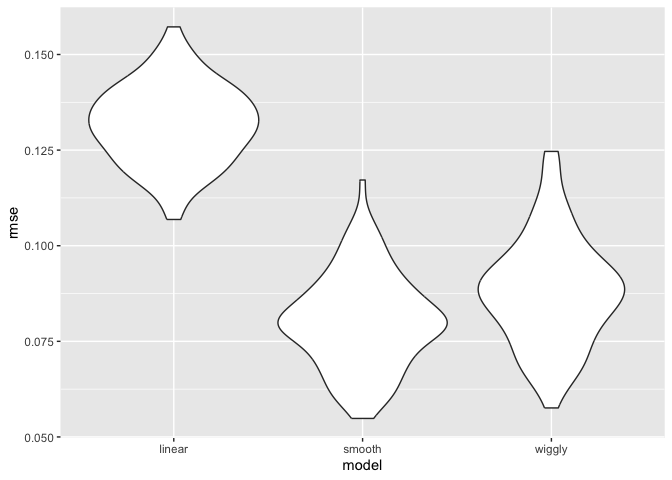

cross_validation
================
2024-11-23

``` r
library(tidyverse)
library(modelr)
library(mgcv)
```

``` r
library(SemiPar)

set.seed(1)
```

look at Lidar data

``` r
data(lidar)

lidar_df = 
  lidar |> 
  as_tibble() |>
  mutate(id = row_number())

lidar_df |> 
  ggplot(aes(x = range, y = logratio)) + 
  geom_point()
```

<!-- --> \##
try to do CV compare 3 models: linear, smooth, wiggly

``` r
train_df = sample_frac(lidar_df, size = 0.8)
test_df = anti_join(lidar_df, train_df, by = "id")
```

``` r
ggplot(train_df, aes(x = range, y = logratio))+
  geom_point()+
  geom_point(data = test_df, color = "red")
```

<!-- --> fit
3 models

``` r
linear_mod = lm(logratio~range, data = train_df)
smooth_mod = gam(logratio ~ s(range), data = train_df)
wiggly_mod = mgcv::gam(logratio ~ s(range, k = 30), sp = 10e-6, data = train_df)
```

To understand what these models have done, I’ll plot the two gam fits.

``` r
train_df |> 
  add_predictions(smooth_mod) |> 
  ggplot(aes(x = range, y = logratio)) + 
  geom_point() + 
  geom_line(aes(y = pred), color = "red")
```

<!-- -->

``` r
train_df |> 
  add_predictions(wiggly_mod) |> 
  ggplot(aes(x = range, y = logratio)) + 
  geom_point() + 
  geom_line(aes(y = pred), color = "red")
```

<!-- -->

check for fits

``` r
train_df |> 
  add_predictions(linear_mod) |> 
  ggplot(aes(x = range, y = logratio))+
  geom_point()+
  geom_line(aes(y = pred), color = "red")+
  geom_point(data = test_df, color = "red")
```

<!-- -->

compare numerically using RMSE

``` r
rmse(linear_mod, test_df)
```

    ## [1] 0.127317

``` r
rmse(smooth_mod, test_df)
```

    ## [1] 0.08302008

``` r
rmse(wiggly_mod, test_df)
```

    ## [1] 0.08848557

# CV using modelr

modelr has tools to automate elements of the CV process. In particular,
crossv_mc preforms the training / testing split multiple times, and
stores the datasets using list columns.

## repeat the train-test split

``` r
cv_df = 
  crossv_mc(lidar_df, 100)
```

crossv_mc tries to be smart about memory – rather than repeating the
dataset a bunch of times, it saves the data once and stores the indexes
for each training / testing split using a resample object. This can be
coerced to a dataframe, and can often be treated exactly like a
dataframe. However, it’s not compatible with gam, so we have to convert
each training and testing dataset (and lose that nice memory-saving
stuff in the process) using the code below. It’s worth noting, though,
that if all the models you want to fit use lm, you can skip this.

``` r
cv_df |> pull(train) |> nth(1) |> as_tibble()
```

    ## # A tibble: 176 × 3
    ##    range logratio    id
    ##    <int>    <dbl> <int>
    ##  1   390  -0.0504     1
    ##  2   394  -0.0510     4
    ##  3   396  -0.0599     5
    ##  4   399  -0.0596     7
    ##  5   400  -0.0399     8
    ##  6   402  -0.0294     9
    ##  7   403  -0.0395    10
    ##  8   405  -0.0476    11
    ##  9   406  -0.0604    12
    ## 10   408  -0.0312    13
    ## # ℹ 166 more rows

``` r
cv_df |> pull(test) |> nth(1) |> as_tibble()
```

    ## # A tibble: 45 × 3
    ##    range logratio    id
    ##    <int>    <dbl> <int>
    ##  1   391  -0.0601     2
    ##  2   393  -0.0419     3
    ##  3   397  -0.0284     6
    ##  4   412  -0.0500    16
    ##  5   421  -0.0316    22
    ##  6   424  -0.0884    24
    ##  7   426  -0.0702    25
    ##  8   427  -0.0288    26
    ##  9   436  -0.0573    32
    ## 10   445  -0.0647    38
    ## # ℹ 35 more rows

``` r
cv_df =
  cv_df |> 
  mutate(
    train = map(train, as_tibble),
    test = map(test, as_tibble))
```

I now have many training and testing datasets, and I’d like to fit my
candidate models above and assess prediction accuracy as I did for the
single training / testing split. To do this, I’ll fit models and obtain
RMSEs using mutate + map & map2.

``` r
cv_df = 
  cv_df |> #fit the regression models on training data
  mutate(
    linear_mod  = map(train, \(df) lm(logratio ~ range, data = df)),
    smooth_mod  = map(train, \(df) gam(logratio ~ s(range), data = df)),
    wiggly_mod  = map(train, \(df) gam(logratio ~ s(range, k = 30), sp = 10e-6, data = df))) |> #calculate the RMSE for the model fit on test data
  mutate(
    rmse_linear = map2_dbl(linear_mod, test, \(mod, df) rmse(model = mod, data = df)),
    rmse_smooth = map2_dbl(smooth_mod, test, \(mod, df) rmse(model = mod, data = df)),
    rmse_wiggly = map2_dbl(wiggly_mod, test, \(mod, df) rmse(model = mod, data = df)))

cv_df
```

    ## # A tibble: 100 × 9
    ##    train    test              .id   linear_mod smooth_mod wiggly_mod rmse_linear
    ##    <list>   <list>            <chr> <list>     <list>     <list>           <dbl>
    ##  1 <tibble> <tibble [45 × 3]> 001   <lm>       <gam>      <gam>            0.129
    ##  2 <tibble> <tibble [45 × 3]> 002   <lm>       <gam>      <gam>            0.133
    ##  3 <tibble> <tibble [45 × 3]> 003   <lm>       <gam>      <gam>            0.118
    ##  4 <tibble> <tibble [45 × 3]> 004   <lm>       <gam>      <gam>            0.123
    ##  5 <tibble> <tibble [45 × 3]> 005   <lm>       <gam>      <gam>            0.140
    ##  6 <tibble> <tibble [45 × 3]> 006   <lm>       <gam>      <gam>            0.141
    ##  7 <tibble> <tibble [45 × 3]> 007   <lm>       <gam>      <gam>            0.125
    ##  8 <tibble> <tibble [45 × 3]> 008   <lm>       <gam>      <gam>            0.131
    ##  9 <tibble> <tibble [45 × 3]> 009   <lm>       <gam>      <gam>            0.117
    ## 10 <tibble> <tibble [45 × 3]> 010   <lm>       <gam>      <gam>            0.136
    ## # ℹ 90 more rows
    ## # ℹ 2 more variables: rmse_smooth <dbl>, rmse_wiggly <dbl>

see distribution of RMSE

``` r
cv_df |> 
  select(starts_with("rmse")) |> 
  pivot_longer(
    everything(),
    names_to = "model", 
    values_to = "rmse",
    names_prefix = "rmse_") |> 
  mutate(model = fct_inorder(model))|> 
  ggplot(aes(x = model, y = rmse)) + geom_violin()
```

<!-- -->

# Example: Child Growth

``` r
child_growth = read_csv("./data/nepalese_children.csv")
```

    ## Rows: 2705 Columns: 5
    ## ── Column specification ────────────────────────────────────────────────────────
    ## Delimiter: ","
    ## dbl (5): age, sex, weight, height, armc
    ## 
    ## ℹ Use `spec()` to retrieve the full column specification for this data.
    ## ℹ Specify the column types or set `show_col_types = FALSE` to quiet this message.

``` r
child_growth |> 
  ggplot(aes(x = weight, y = armc)) + 
  geom_point(alpha = .5)
```

<!-- -->
The plots suggests some non-linearity, especially at the low end of the
weight distribution. We’ll try three models: a linear fit; a piecewise
linear fit; and a smooth fit using gam.

``` r
child_growth =
  child_growth |> 
  mutate(weight_cp7 = (weight > 7) * (weight - 7))
```

``` r
linear_mod = lm(armc ~ weight, data = child_growth)
pwl_mod    = lm(armc ~ weight + weight_cp7, data = child_growth)
smooth_mod = gam(armc ~ s(weight), data = child_growth)
```

``` r
child_growth |> 
  add_predictions(model = smooth_mod) |> 
  ggplot(aes(x = weight, y = armc))+
  geom_point(alpha = .5)+
  geom_line(aes(y = pred), color = "red")
```

<!-- --> Do
cross validation to select models

``` r
cv_df =
  crossv_mc(child_growth, 100) |> 
  mutate(
    train = map(train, as_tibble),
    test = map(test, as_tibble))
```

``` r
cv_df = 
  cv_df |> 
  mutate(
    linear_mod  = map(train, \(df) lm(armc ~ weight, data = df)),
    pwl_mod     = map(train, \(df) lm(armc ~ weight + weight_cp7, data = df)),
    smooth_mod  = map(train, \(df) gam(armc ~ s(weight), data = as_tibble(df)))) |> 
  mutate(
    rmse_linear = map2_dbl(linear_mod, test, \(mod, df) rmse(model = mod, data = df)),
    rmse_pwl    = map2_dbl(pwl_mod, test, \(mod, df) rmse(model = mod, data = df)),
    rmse_smooth = map2_dbl(smooth_mod, test, \(mod, df) rmse(model = mod, data = df)))
```

``` r
cv_df |> 
  select(starts_with("rmse")) |> 
  pivot_longer(
    everything(),
    names_to = "model", 
    values_to = "rmse",
    names_prefix = "rmse_") |> 
  mutate(model = fct_inorder(model)) |> 
  ggplot(aes(x = model, y = rmse)) + geom_violin()
```

<!-- -->

Based on these results, there’s clearly some improvement in predictive
accuracy gained by allowing non-linearity – whether this is sufficient
to justify a more complex model isn’t obvious, though. Among the
non-linear models, the smooth fit from gam might be a bit better than
the piecewise linear model. Which candidate model is best, though,
depends a bit on the need to balance complexity with goodness of fit and
interpretability. In the end, I’d probably go with the piecewise linear
model – the non-linearity is clear enough that it should be accounted
for, and the differences between the piecewise and gam fits are small
enough that the easy interpretation of the piecewise model “wins”.
