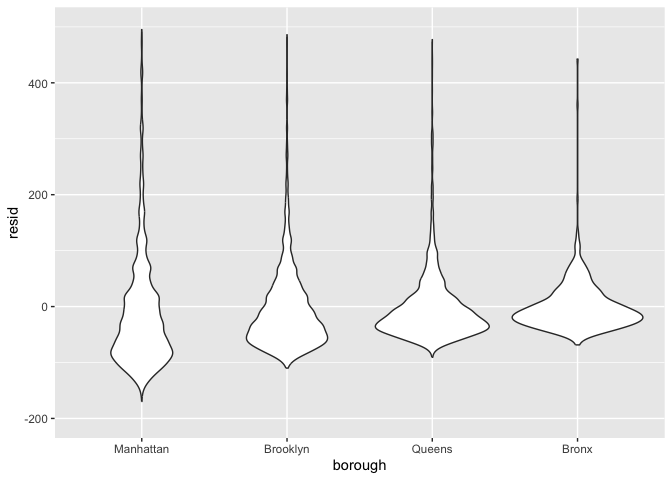
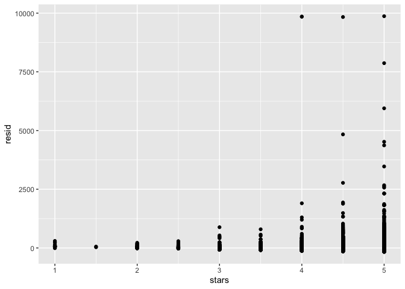

linear_models
================
2024-11-19

``` r
library(tidyverse)
library(p8105.datasets)

set.seed(1)
```

import data

``` r
data("nyc_airbnb")

nyc_airbnb = 
  nyc_airbnb |> 
  mutate(stars = review_scores_location / 2) |> 
  rename(
    borough = neighbourhood_group,
    neighborhood = neighbourhood) |> 
  filter(borough != "Staten Island") |> 
  select(price, stars, borough, neighborhood, room_type) %>% 
  mutate(
    borough = fct_infreq(borough),
    room_type = fct_infreq(room_type)
  )
```

linear model

``` r
fit = lm(price ~ stars + borough, data = nyc_airbnb)

summary(fit)
```

    ## 
    ## Call:
    ## lm(formula = price ~ stars + borough, data = nyc_airbnb)
    ## 
    ## Residuals:
    ##    Min     1Q Median     3Q    Max 
    ## -169.8  -64.0  -29.0   20.2 9870.0 
    ## 
    ## Coefficients:
    ##                 Estimate Std. Error t value Pr(>|t|)    
    ## (Intercept)       19.839     12.189   1.628    0.104    
    ## stars             31.990      2.527  12.657   <2e-16 ***
    ## boroughBrooklyn  -49.754      2.235 -22.262   <2e-16 ***
    ## boroughQueens    -77.048      3.727 -20.675   <2e-16 ***
    ## boroughBronx     -90.254      8.567 -10.534   <2e-16 ***
    ## ---
    ## Signif. codes:  0 '***' 0.001 '**' 0.01 '*' 0.05 '.' 0.1 ' ' 1
    ## 
    ## Residual standard error: 181.5 on 30525 degrees of freedom
    ##   (9962 observations deleted due to missingness)
    ## Multiple R-squared:  0.03423,    Adjusted R-squared:  0.03411 
    ## F-statistic: 270.5 on 4 and 30525 DF,  p-value: < 2.2e-16

``` r
summary(fit)$coef
```

    ##                  Estimate Std. Error    t value      Pr(>|t|)
    ## (Intercept)      19.83946  12.189256   1.627619  1.036160e-01
    ## stars            31.98989   2.527500  12.656733  1.269392e-36
    ## boroughBrooklyn -49.75363   2.234878 -22.262345 6.317605e-109
    ## boroughQueens   -77.04776   3.726632 -20.674904  2.584908e-94
    ## boroughBronx    -90.25393   8.567490 -10.534465  6.638618e-26

``` r
coef(fit)
```

    ##     (Intercept)           stars boroughBrooklyn   boroughQueens    boroughBronx 
    ##        19.83946        31.98989       -49.75363       -77.04776       -90.25393

``` r
y_hat = fitted.values(fit)

names(summary(fit))
```

    ##  [1] "call"          "terms"         "residuals"     "coefficients" 
    ##  [5] "aliased"       "sigma"         "df"            "r.squared"    
    ##  [9] "adj.r.squared" "fstatistic"    "cov.unscaled"  "na.action"

``` r
#generate a table
broom::tidy(fit)
```

    ## # A tibble: 5 × 5
    ##   term            estimate std.error statistic   p.value
    ##   <chr>              <dbl>     <dbl>     <dbl>     <dbl>
    ## 1 (Intercept)         19.8     12.2       1.63 1.04e-  1
    ## 2 stars               32.0      2.53     12.7  1.27e- 36
    ## 3 boroughBrooklyn    -49.8      2.23    -22.3  6.32e-109
    ## 4 boroughQueens      -77.0      3.73    -20.7  2.58e- 94
    ## 5 boroughBronx       -90.3      8.57    -10.5  6.64e- 26

``` r
fit %>% 
  broom::tidy() %>% 
  select(term, estimate, p.value) %>% 
  mutate(
    term = str_replace(term, "borough", "Borough: ")
  ) %>% 
  knitr::kable(digits = 3)
```

| term              | estimate | p.value |
|:------------------|---------:|--------:|
| (Intercept)       |   19.839 |   0.104 |
| stars             |   31.990 |   0.000 |
| Borough: Brooklyn |  -49.754 |   0.000 |
| Borough: Queens   |  -77.048 |   0.000 |
| Borough: Bronx    |  -90.254 |   0.000 |

``` r
fit %>% 
  broom::glance()
```

    ## # A tibble: 1 × 12
    ##   r.squared adj.r.squared sigma statistic   p.value    df   logLik    AIC    BIC
    ##       <dbl>         <dbl> <dbl>     <dbl>     <dbl> <dbl>    <dbl>  <dbl>  <dbl>
    ## 1    0.0342        0.0341  182.      271. 6.73e-229     4 -202113. 4.04e5 4.04e5
    ## # ℹ 3 more variables: deviance <dbl>, df.residual <int>, nobs <int>

## Diagnostics

first, some EDA

``` r
nyc_airbnb %>% 
  ggplot(aes(x = stars, y = price))+
  geom_point()+
  stat_smooth(method = "lm")
```

    ## `geom_smooth()` using formula = 'y ~ x'

    ## Warning: Removed 9962 rows containing non-finite outside the scale range
    ## (`stat_smooth()`).

    ## Warning: Removed 9962 rows containing missing values or values outside the scale range
    ## (`geom_point()`).

<!-- -->

``` r
modelr::add_residuals(nyc_airbnb, fit)
```

    ## # A tibble: 40,492 × 6
    ##    price stars borough neighborhood room_type        resid
    ##    <dbl> <dbl> <fct>   <chr>        <fct>            <dbl>
    ##  1    99   5   Bronx   City Island  Private room      9.47
    ##  2   200  NA   Bronx   City Island  Private room     NA   
    ##  3   300  NA   Bronx   City Island  Entire home/apt  NA   
    ##  4   125   5   Bronx   City Island  Entire home/apt  35.5 
    ##  5    69   5   Bronx   City Island  Private room    -20.5 
    ##  6   125   5   Bronx   City Island  Entire home/apt  35.5 
    ##  7    85   5   Bronx   City Island  Entire home/apt  -4.53
    ##  8    39   4.5 Bronx   Allerton     Private room    -34.5 
    ##  9    95   5   Bronx   Allerton     Entire home/apt   5.47
    ## 10   125   4.5 Bronx   Allerton     Entire home/apt  51.5 
    ## # ℹ 40,482 more rows

``` r
modelr::add_predictions(nyc_airbnb, fit)
```

    ## # A tibble: 40,492 × 6
    ##    price stars borough neighborhood room_type        pred
    ##    <dbl> <dbl> <fct>   <chr>        <fct>           <dbl>
    ##  1    99   5   Bronx   City Island  Private room     89.5
    ##  2   200  NA   Bronx   City Island  Private room     NA  
    ##  3   300  NA   Bronx   City Island  Entire home/apt  NA  
    ##  4   125   5   Bronx   City Island  Entire home/apt  89.5
    ##  5    69   5   Bronx   City Island  Private room     89.5
    ##  6   125   5   Bronx   City Island  Entire home/apt  89.5
    ##  7    85   5   Bronx   City Island  Entire home/apt  89.5
    ##  8    39   4.5 Bronx   Allerton     Private room     73.5
    ##  9    95   5   Bronx   Allerton     Entire home/apt  89.5
    ## 10   125   4.5 Bronx   Allerton     Entire home/apt  73.5
    ## # ℹ 40,482 more rows

``` r
nyc_airbnb |> 
  modelr::add_residuals(fit) |> 
  ggplot(aes(x = borough, y = resid)) + geom_violin()+
  ylim(-200,500)
```

    ## Warning: Removed 10202 rows containing non-finite outside the scale range
    ## (`stat_ydensity()`).

<!-- -->

risiduals against stars

``` r
nyc_airbnb |> 
  modelr::add_residuals(fit) |> 
  ggplot(aes(x = stars, y = resid))+
  geom_point()
```

    ## Warning: Removed 9962 rows containing missing values or values outside the scale range
    ## (`geom_point()`).

<!-- -->

``` r
nyc_airbnb |> 
  modelr::add_residuals(fit) |> 
  modelr::add_predictions(fit) |> 
  ggplot(aes(x = pred, y = resid))+
  geom_point()
```

    ## Warning: Removed 9962 rows containing missing values or values outside the scale range
    ## (`geom_point()`).

<!-- --> \##
hypothesis testing for single coefficients, look at the table

``` r
fit %>% 
  broom::tidy()
```

    ## # A tibble: 5 × 5
    ##   term            estimate std.error statistic   p.value
    ##   <chr>              <dbl>     <dbl>     <dbl>     <dbl>
    ## 1 (Intercept)         19.8     12.2       1.63 1.04e-  1
    ## 2 stars               32.0      2.53     12.7  1.27e- 36
    ## 3 boroughBrooklyn    -49.8      2.23    -22.3  6.32e-109
    ## 4 boroughQueens      -77.0      3.73    -20.7  2.58e- 94
    ## 5 boroughBronx       -90.3      8.57    -10.5  6.64e- 26

``` r
fit_null = lm(price ~ stars + borough, data = nyc_airbnb)
fit_alt = lm(price ~ stars + borough + room_type, data = nyc_airbnb)
```

look at both

``` r
fit_null %>% 
  broom::tidy()
```

    ## # A tibble: 5 × 5
    ##   term            estimate std.error statistic   p.value
    ##   <chr>              <dbl>     <dbl>     <dbl>     <dbl>
    ## 1 (Intercept)         19.8     12.2       1.63 1.04e-  1
    ## 2 stars               32.0      2.53     12.7  1.27e- 36
    ## 3 boroughBrooklyn    -49.8      2.23    -22.3  6.32e-109
    ## 4 boroughQueens      -77.0      3.73    -20.7  2.58e- 94
    ## 5 boroughBronx       -90.3      8.57    -10.5  6.64e- 26

``` r
fit_alt %>% 
  broom::tidy()
```

    ## # A tibble: 7 × 5
    ##   term                  estimate std.error statistic  p.value
    ##   <chr>                    <dbl>     <dbl>     <dbl>    <dbl>
    ## 1 (Intercept)              113.      11.8       9.54 1.56e-21
    ## 2 stars                     21.9      2.43      9.01 2.09e-19
    ## 3 boroughBrooklyn          -40.3      2.15    -18.8  4.62e-78
    ## 4 boroughQueens            -55.5      3.59    -15.4  1.32e-53
    ## 5 boroughBronx             -63.0      8.22     -7.67 1.76e-14
    ## 6 room_typePrivate room   -105.       2.05    -51.2  0       
    ## 7 room_typeShared room    -129.       6.15    -21.0  2.24e-97

``` r
# compare nested models (models with only 1 term different)
anova(fit_null, fit_alt) %>% 
  broom::tidy()
```

    ## # A tibble: 2 × 7
    ##   term                        df.residual    rss    df   sumsq statistic p.value
    ##   <chr>                             <dbl>  <dbl> <dbl>   <dbl>     <dbl>   <dbl>
    ## 1 price ~ stars + borough           30525 1.01e9    NA NA            NA       NA
    ## 2 price ~ stars + borough + …       30523 9.21e8     2  8.42e7     1394.       0

## Do effects differ across boroughs

first, use interactions

``` r
nyc_airbnb %>% 
  lm(price~stars * borough + room_type * borough, data = .)
```

    ## 
    ## Call:
    ## lm(formula = price ~ stars * borough + room_type * borough, data = .)
    ## 
    ## Coefficients:
    ##                           (Intercept)                                  stars  
    ##                                95.694                                 27.110  
    ##                       boroughBrooklyn                          boroughQueens  
    ##                               -26.066                                 -4.118  
    ##                          boroughBronx                  room_typePrivate room  
    ##                                -5.627                               -124.188  
    ##                  room_typeShared room                  stars:boroughBrooklyn  
    ##                              -153.635                                 -6.139  
    ##                   stars:boroughQueens                     stars:boroughBronx  
    ##                               -17.455                                -22.664  
    ## boroughBrooklyn:room_typePrivate room    boroughQueens:room_typePrivate room  
    ##                                31.965                                 54.933  
    ##    boroughBronx:room_typePrivate room   boroughBrooklyn:room_typeShared room  
    ##                                71.273                                 47.797  
    ##    boroughQueens:room_typeShared room      boroughBronx:room_typeShared room  
    ##                                58.662                                 83.089

# Hypothesis Testing

Testing multiple coefficients is somewhat more complicated. A useful
approach is to use nested models, meaning that the terms in a simple
“null” model are a subset of the terms in a more complex “alternative”
model. The are formal tests for comparing the null and alternative
models, even when several coefficients are added in the alternative
model. Tests of this kind are required to assess the significance of a
categorical predictor with more than two levels, as in the example
below.

``` r
fit_null = lm(price ~ stars + borough, data = nyc_airbnb)
fit_alt = lm(price ~ stars + borough + room_type, data = nyc_airbnb)
```

The test of interest is implemented in the anova() function which can be
summarized using broom::tidy().

``` r
anova(fit_null, fit_alt) |> 
  broom::tidy()
```

    ## # A tibble: 2 × 7
    ##   term                        df.residual    rss    df   sumsq statistic p.value
    ##   <chr>                             <dbl>  <dbl> <dbl>   <dbl>     <dbl>   <dbl>
    ## 1 price ~ stars + borough           30525 1.01e9    NA NA            NA       NA
    ## 2 price ~ stars + borough + …       30523 9.21e8     2  8.42e7     1394.       0

Note that this works for nested models only.

# Nesting data

We’ll now turn our attention to fitting models to datasets nested within
variables – meaning, essentially, that we’ll use nest() to create a list
column containing datasets and fit separate models to each. This is very
different from fitting nested models, even though the terminology is
similar.

In the airbnb data, we might think that star ratings and room type
affects price differently in each borough. One way to allow this kind of
effect modification is through interaction terms:

``` r
nyc_airbnb |> 
  lm(price ~ stars * borough + room_type * borough, data = _) |> 
  broom::tidy() |> 
  knitr::kable(digits = 3)
```

| term                                  | estimate | std.error | statistic | p.value |
|:--------------------------------------|---------:|----------:|----------:|--------:|
| (Intercept)                           |   95.694 |    19.184 |     4.988 |   0.000 |
| stars                                 |   27.110 |     3.965 |     6.838 |   0.000 |
| boroughBrooklyn                       |  -26.066 |    25.080 |    -1.039 |   0.299 |
| boroughQueens                         |   -4.118 |    40.674 |    -0.101 |   0.919 |
| boroughBronx                          |   -5.627 |    77.808 |    -0.072 |   0.942 |
| room_typePrivate room                 | -124.188 |     2.996 |   -41.457 |   0.000 |
| room_typeShared room                  | -153.635 |     8.692 |   -17.676 |   0.000 |
| stars:boroughBrooklyn                 |   -6.139 |     5.237 |    -1.172 |   0.241 |
| stars:boroughQueens                   |  -17.455 |     8.539 |    -2.044 |   0.041 |
| stars:boroughBronx                    |  -22.664 |    17.099 |    -1.325 |   0.185 |
| boroughBrooklyn:room_typePrivate room |   31.965 |     4.328 |     7.386 |   0.000 |
| boroughQueens:room_typePrivate room   |   54.933 |     7.459 |     7.365 |   0.000 |
| boroughBronx:room_typePrivate room    |   71.273 |    18.002 |     3.959 |   0.000 |
| boroughBrooklyn:room_typeShared room  |   47.797 |    13.895 |     3.440 |   0.001 |
| boroughQueens:room_typeShared room    |   58.662 |    17.897 |     3.278 |   0.001 |
| boroughBronx:room_typeShared room     |   83.089 |    42.451 |     1.957 |   0.050 |

This works, but the output takes time to think through – the expected
change in price comparing an entire apartment to a private room in
Queens, for example, involves the main effect of room type and the
Queens / private room interaction.

Alternatively, we can nest within boroughs and fit borough-specific
models associating price with rating and room type:

``` r
nest_lm_res =
  nyc_airbnb |> 
  nest(data = -borough) |> 
  mutate(
    models = map(data, \(df) lm(price ~ stars + room_type, data = df)),
    results = map(models, broom::tidy)) |> 
  select(-data, -models) |> 
  unnest(results)

nest_lm_res
```

    ## # A tibble: 16 × 6
    ##    borough   term                  estimate std.error statistic   p.value
    ##    <fct>     <chr>                    <dbl>     <dbl>     <dbl>     <dbl>
    ##  1 Bronx     (Intercept)              90.1      15.2       5.94 5.73e-  9
    ##  2 Bronx     stars                     4.45      3.35      1.33 1.85e-  1
    ##  3 Bronx     room_typePrivate room   -52.9       3.57    -14.8  6.21e- 41
    ##  4 Bronx     room_typeShared room    -70.5       8.36     -8.44 4.16e- 16
    ##  5 Queens    (Intercept)              91.6      25.8       3.54 4.00e-  4
    ##  6 Queens    stars                     9.65      5.45      1.77 7.65e-  2
    ##  7 Queens    room_typePrivate room   -69.3       4.92    -14.1  1.48e- 43
    ##  8 Queens    room_typeShared room    -95.0      11.3      -8.43 5.52e- 17
    ##  9 Brooklyn  (Intercept)              69.6      14.0       4.96 7.27e-  7
    ## 10 Brooklyn  stars                    21.0       2.98      7.05 1.90e- 12
    ## 11 Brooklyn  room_typePrivate room   -92.2       2.72    -34.0  6.40e-242
    ## 12 Brooklyn  room_typeShared room   -106.        9.43    -11.2  4.15e- 29
    ## 13 Manhattan (Intercept)              95.7      22.2       4.31 1.62e-  5
    ## 14 Manhattan stars                    27.1       4.59      5.91 3.45e-  9
    ## 15 Manhattan room_typePrivate room  -124.        3.46    -35.8  9.40e-270
    ## 16 Manhattan room_typeShared room   -154.       10.1     -15.3  2.47e- 52

The results of this approach are given in the table below.

``` r
nest_lm_res |> 
  select(borough, term, estimate) |> 
  mutate(term = fct_inorder(term)) |> 
  pivot_wider(
    names_from = term, values_from = estimate) |> 
  knitr::kable(digits = 3)
```

| borough   | (Intercept) |  stars | room_typePrivate room | room_typeShared room |
|:----------|------------:|-------:|----------------------:|---------------------:|
| Bronx     |      90.067 |  4.446 |               -52.915 |              -70.547 |
| Queens    |      91.575 |  9.654 |               -69.255 |              -94.973 |
| Brooklyn  |      69.627 | 20.971 |               -92.223 |             -105.839 |
| Manhattan |      95.694 | 27.110 |              -124.188 |             -153.635 |

Fitting models to nested datasets is a way of performing stratified
analyses. These have a tradeoff: stratified models make it easy to
interpret covariate effects in each stratum, but don’t provide a
mechanism for assessing the significance of differences across strata.

An even more extreme example is the assessment of neighborhood effects
in Manhattan. The code chunk below fits neighborhood-specific models:

``` r
manhattan_airbnb =
  nyc_airbnb |> 
  filter(borough == "Manhattan")

manhattan_nest_lm_res =
  manhattan_airbnb |> 
  nest(data = -neighborhood) |> 
  mutate(
    models = map(data, \(df) lm(price ~ stars + room_type, data = df)),
    results = map(models, broom::tidy)) |> 
  select(-data, -models) |> 
  unnest(results)
```

And the chunk below shows neighborhood-specific estimates for the
coefficients related to room type.

``` r
manhattan_nest_lm_res |> 
  filter(str_detect(term, "room_type")) |> 
  ggplot(aes(x = neighborhood, y = estimate)) + 
  geom_point() + 
  facet_wrap(~term) + 
  theme(axis.text.x = element_text(angle = 80, hjust = 1))
```

<!-- -->

There is, generally speaking, a reduction in room price for a private
room or a shared room compared to an entire apartment, but this varies
quite a bit across neighborhoods.

With this many factor levels, it really isn’t a good idea to fit models
with main effects or interactions for each. Instead, you’d be best-off
using a mixed model, with random intercepts and slopes for each
neighborhood. Although it’s well beyond the scope of this class, code to
fit a mixed model with neighborhood-level random intercepts and random
slopes for room type is below. And, of course, we can tidy the results
using a mixed-model spinoff of the broom package.

``` r
manhattan_airbnb |> 
  lme4::lmer(price ~ stars + room_type + (1 + room_type | neighborhood), data = _) |> 
  broom.mixed::tidy()
```

    ## Warning in checkConv(attr(opt, "derivs"), opt$par, ctrl = control$checkConv, :
    ## Model failed to converge with max|grad| = 0.0045733 (tol = 0.002, component 1)

    ## # A tibble: 11 × 6
    ##    effect   group        term                       estimate std.error statistic
    ##    <chr>    <chr>        <chr>                         <dbl>     <dbl>     <dbl>
    ##  1 fixed    <NA>         (Intercept)                 250.        26.6      9.41 
    ##  2 fixed    <NA>         stars                        -3.16       5.00    -0.631
    ##  3 fixed    <NA>         room_typePrivate room      -124.         7.80   -15.9  
    ##  4 fixed    <NA>         room_typeShared room       -157.        12.9    -12.2  
    ##  5 ran_pars neighborhood sd__(Intercept)              59.3       NA       NA    
    ##  6 ran_pars neighborhood cor__(Intercept).room_typ…   -0.987     NA       NA    
    ##  7 ran_pars neighborhood cor__(Intercept).room_typ…   -1.00      NA       NA    
    ##  8 ran_pars neighborhood sd__room_typePrivate room    36.7       NA       NA    
    ##  9 ran_pars neighborhood cor__room_typePrivate roo…    0.992     NA       NA    
    ## 10 ran_pars neighborhood sd__room_typeShared room     43.6       NA       NA    
    ## 11 ran_pars Residual     sd__Observation             198.        NA       NA

# Binary outcomes

Linear models are appropriate for outcomes that follow a continuous
distribution, but binary outcomes are common. In these cases, logistic
regression is a useful analytic framework.

``` r
baltimore_df = 
  read_csv("data/homicide-data.csv") |> 
  filter(city == "Baltimore") |> 
  mutate(
    resolved = as.numeric(disposition == "Closed by arrest"),
    victim_age = as.numeric(victim_age),
    victim_race = fct_relevel(victim_race, "White")) |> 
  select(resolved, victim_age, victim_race, victim_sex)
```

    ## Rows: 52179 Columns: 12
    ## ── Column specification ────────────────────────────────────────────────────────
    ## Delimiter: ","
    ## chr (9): uid, victim_last, victim_first, victim_race, victim_age, victim_sex...
    ## dbl (3): reported_date, lat, lon
    ## 
    ## ℹ Use `spec()` to retrieve the full column specification for this data.
    ## ℹ Specify the column types or set `show_col_types = FALSE` to quiet this message.

``` r
fit_logistic = 
  baltimore_df |> 
  glm(resolved ~ victim_age + victim_race + victim_sex, data = _, family = binomial()) 
```

Many of the same tools we used to work with lm fits can be used for glm
fits. The table below summaries the coefficients from the model fit;
because logistic model estimates are log odds ratios, we include a step
to compute odds ratios as well.

``` r
fit_logistic |> 
  broom::tidy() |> 
  mutate(OR = exp(estimate)) |>
  select(term, log_OR = estimate, OR, p.value) |> 
  knitr::kable(digits = 3)
```

| term                | log_OR |    OR | p.value |
|:--------------------|-------:|------:|--------:|
| (Intercept)         |  1.190 | 3.287 |   0.000 |
| victim_age          | -0.007 | 0.993 |   0.027 |
| victim_raceAsian    |  0.296 | 1.345 |   0.653 |
| victim_raceBlack    | -0.842 | 0.431 |   0.000 |
| victim_raceHispanic | -0.265 | 0.767 |   0.402 |
| victim_raceOther    | -0.768 | 0.464 |   0.385 |
| victim_sexMale      | -0.880 | 0.415 |   0.000 |

Homicides in which the victim is Black are substantially less likely to
be resolved that those in which the victim is white; for other races the
effects are not significant, possible due to small sample sizes.
Homicides in which the victim is male are significantly less like to be
resolved than those in which the victim is female. The effect of age is
statistically significant, but careful data inspections should be
conducted before interpreting too deeply.

We can also compute fitted values; similarly to the estimates in the
model summary, these are expressed as log odds and can be transformed to
produce probabilities for each subject.

``` r
baltimore_df |> 
  modelr::add_predictions(fit_logistic) |> 
  mutate(fitted_prob = boot::inv.logit(pred))
```

    ## # A tibble: 2,827 × 6
    ##    resolved victim_age victim_race victim_sex    pred fitted_prob
    ##       <dbl>      <dbl> <fct>       <chr>        <dbl>       <dbl>
    ##  1        0         17 Black       Male       -0.654        0.342
    ##  2        0         26 Black       Male       -0.720        0.327
    ##  3        0         21 Black       Male       -0.683        0.335
    ##  4        1         61 White       Male       -0.131        0.467
    ##  5        1         46 Black       Male       -0.864        0.296
    ##  6        1         27 Black       Male       -0.727        0.326
    ##  7        1         21 Black       Male       -0.683        0.335
    ##  8        1         16 Black       Male       -0.647        0.344
    ##  9        1         21 Black       Male       -0.683        0.335
    ## 10        1         44 Black       Female      0.0297       0.507
    ## # ℹ 2,817 more rows
